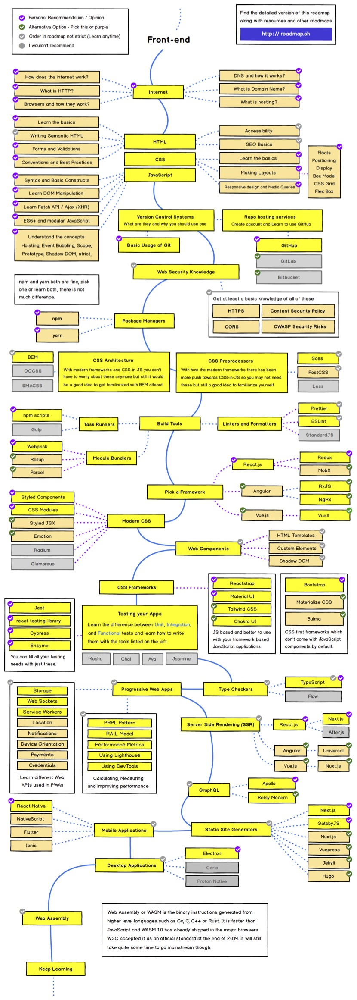

# Frontend Roadmap 2022

This document  serves as a walkthrough for newcomers who want to prosper their career in frontend developement.

## Effective ways of learning
- Focus on fundamentals
- Learn by doing. Practice the code with examples
- Learn to ask for help
- Take a break from code debugging when necessary
- Do More Than Just Read Sample Code
- Check out useful resources

## Opinionated
In recent years, [React.js](https://reactjs.org/) is getting a good impression. If we look at the [StackOverflow survey of 2021](https://insights.stackoverflow.com/survey/2021?_ga=2.143519986.693422786.1653535525-940540015.1653535525#section-most-popular-technologies-web-frameworks), React.js is the most commonly used web framework.
This roadmap has used React as an example, however, one can pick any other framework such as [Vue.js](https://vuejs.org/) or [Angular](https://angular.io/start). These three frameworks three major frameworks are similar in essence and have great demand. 

## Roadmap
The decisive frontend journey is shown below.

Frontend development is a practise of producing website or  Web Application using HTML, JS and CSS that can be seen and interacted by the user. With the  everchanging tools and technologies used for the development one has to keep in updated. 

## Pre-requisites

Most of things are done in internet, so its good to has some  understanding about inner working of Internet, which are caretoriged as below:
   
   * Internet 
      - Internet is global networks of computers connected togther that communicates through a stanadard set of protocols.
      
   * Domain Name and DNS 
      - Domain Name is a unique name, easy-to-remember address used to access websites such as 'google.com' with the help of DNS. DNS maps the ip address with domain name and serves the resources.
   
   * Hosting
     - Hosting allows you to publish internet files onto so that everybody on the internet can access it.
 
   * HTTP Basics
     - HTTP  uses `TCP/IP` communication protocal that defined how the content should be transmitted over the internet. 
     
   * Browsers and thier working mechanisms
     -  Browsers are software application  that enables that enables a user to access and display web pages or other online content through its graphical      user interface.
     
## Foundation Layer
Getting a strong  grasp of the fundamentals is beneficial for long term  success. It will allow to grasp complex logic further along.  HTML , CSS and JavaScript are the core foundations in frontend development which are described  below.
1. HTML
   - HTML stands for HyperText Markup Language and  is used to give structure to the webpage. It can be styled using CSS and make interactive using Javascript. 

    * HTML Semantics elements clearly describes its meaning to both the browser and developer. `<form>`, `<table>` are some of its example.
    * Validations are performed to make sure that all required for fill out in correct format before submitting the data to the server. This whole process
    is also known as client-side validation.
2. CSS

   * CSS stands for Cascading Style Sheets and is used to style the websites or web applications.
   * Float, grid, flexbox, positioning, display and box model are some of the important topics that are used for making layouts. 
   * CSS Cascade is the way our browsers resolve competing CSS declarations.
   * CSS preprocessor is a program that lets you generate CSS from the preprocessor's own unique syntax. `SASS`, `LESS`, `Stylus` are some of the examples of it.
   * CSS is notoriously difficult to manage in large, complex, rapidly-iterated systems. `BEM`, `OOCSS`, `SMACSS` are some of the ways of writing CSS that allows in writing more maintainable CSS.
   
4. Javascript

   * It adds interactivity to an webpage. `Sliders`, `Cick interactions`, `popups` are some of its common implmentation seen in websites.
   * Document Object Model (DOM)  is a programming interface for web documents that allows to change the document structure, style, and content. It views document as tree of nodes and objects. 
   * Closure is a function that references variables in the outer scope from its inner scope. The closure preserves the outer scope inside its inner scope.
   * ES6 brings new syntax and new awesome features to make your code more modern and more readable. It allows you to write less code and do more.
   * Fetch API provides a JavaScript interface for accessing and manipulating parts of the HTTP pipeline, such as requests and responses. 
   * Hoisting refers to the process whereby the interpreter appears to move the declaration of functions, variables or classes to the top of their scope, prior to execution of the code. It allows `functions` to be safely used in code before they are declared.
   
   
## Bonus Section
   * Version Control and Repository Hosting
     - It allows is colloraborative tool that allows  to track changes to of the codebase/files over time.  Backtracking is also possible here.
     - `Github`, `GitLab` and `BitBucket` are some of the famous repository hosting services.
   
   
## Node, TS and the ecosystem

1. NodeJS
   - Node.js is a JavaScript runtime built on Chrome's V8 JavaScript engine designed to build scalable node applications.
   - `npm` is a package manager for the JavaScript programming language maintained by npm, Inc. It is the default package manager for Node.js.
   - `yarn` is a software packaging system developed in 2016 by Facebook for Node.js JavaScript runtime environment that provides speed, consistency, stability, and security as an alternative to npm (package manager)
   - Task Runner are tools to simplify your tedious work on development, like automating sass/scss compiler, bundling assets, linting source code, hot reloading local server. 
   - npm scripts are the entries in the scripts field of the `package.json` file where we specify various commands and scripts that we want to expose.
   - Module bundler is a tool that takes pieces of JavaScript and their dependencies and bundles them into a single file, usually for use in the browser. `webpack`, `esbuild`, `parcel` are some of examples of it.
   - Webpack is a module bundler capable of transforming, bundling, or packaging just about any resource or asset.
   - Babel is a toolchain that is mainly used to convert ECMAScript 2015+ code into a backwards compatible version of JavaScript in current and older browsers or environments.
   - A linter is a tool used to analyze code and discover bugs, syntax errors, stylistic inconsistencies, and suspicious constructs.  `ESLint`, `JSLint`, and `JSHint` are some of the popular javascript linters.
   - Prettier is an opinionated code formatter with support for JavaScript, HTML, CSS, and more.
   - With ES6 modules one can easily reuse, maintain, separate and encapsulate components from being changed by external behavior.
  
 2. Typescript
    - TypeScript is a strongly typed programming language that builds on JavaScript, giving better tooling at any scale. 
    - The `tsc` command envokes the TypeScript compiler. When no command-line options are present, this command looks for the tsconfig.json file.
    - TypeScript Generics is a tool which provides a way to create reusable components. It creates a component that can work with a variety of data types rather than a single data type.
    - The type declarations are reside under @typings of javascript libraries.
  
  3. Functional Programming in JS/TS
     - Functional programming (often abbreviated FP) is the process of building software by composing pure functions, avoiding shared state, mutable data, and side-effects. Functional programming is declarative rather than imperative, and application state flows through pure functions.
     - Functions that operate on other functions, either by taking them as arguments or by returning them, are called higher-order functions.
     - A pure function works as an independent function that gives the same output for the same inputs. 
     - Currying is a process in functional programming in which we can transform a function with multiple arguments into a sequence of nesting functions.
     - Composition is about creating small functions and creating bigger and more complete functions with them.
     - Memoization is an optimization technique used primarily to speed up computer programs by storing the results of expensive function calls and returning the cached result when the same inputs occur again.
     - `.map()` is  when we want to transform elements in an array, wheras `.reduce()` is used when you want derive a single value from multiple elements in an array.
     - `.filter()` selectss a subset of multiple elements from an array and `.forEach()` is used to execute a function for each individual element in an array.
 

## Updating this doc
Feel free to comment with links to free courses and topics that should be added here.

